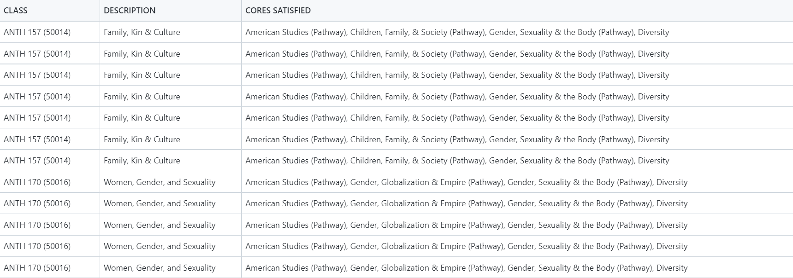
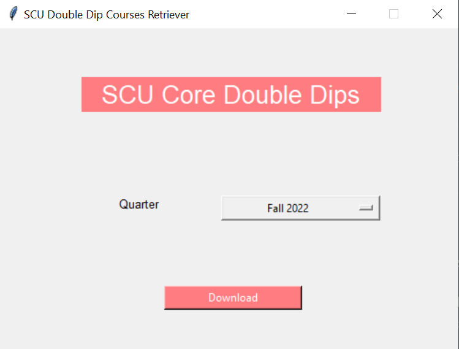

# SCU Double Dip Courses Checker

- Hello there, SCU Engineers! Do you ever get confused about which courses to take when you need to fulfill both university cores and major requirements? Look no further - this small program retrieves data from the CourseAvail API and outputs the most recent quarter's double dip classes in CSV format for easy viewing. It can also retrieve data from previous quarters.

    

## Future Updates (Coming Very Soon): 

- Create a Python GUI for easy access and allow users to download it locally as an exe. Make it dynamic by allowing computer notifications to refresh every 20, 40, and 60 seconds to update seats that change frequently.

- The UI should use colored tags, A-Z filtering, and the SCU color palette in general. Perhaps convert CSV to PDF format and make the TKinter GUI a PDF viewer instead of rendering large amounts of CSV data (e.g. upwards of 4,300 entries!) within the GUI itself.

    

## Credits:

- [Walker Selby](https://github.com/walkerselby/): Author and Programmer of [original concept](https://github.com/walkerselby/SCU-Double-Dips)